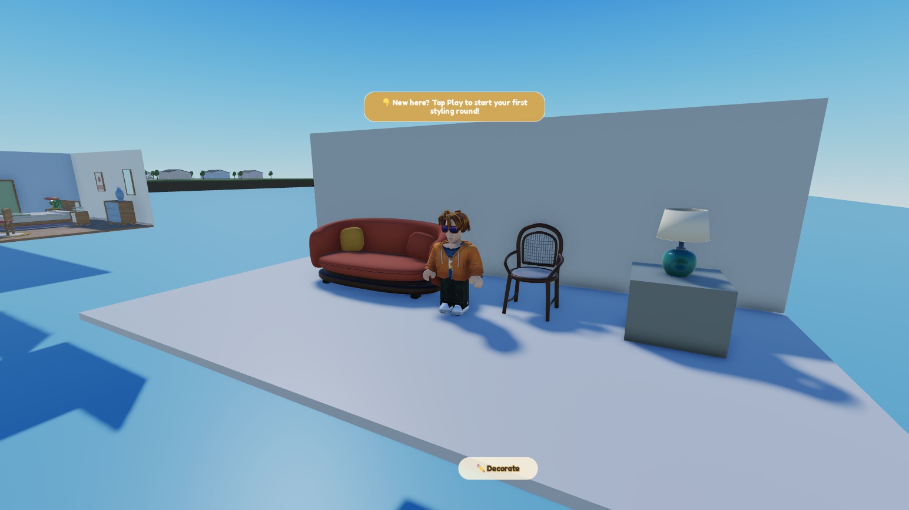
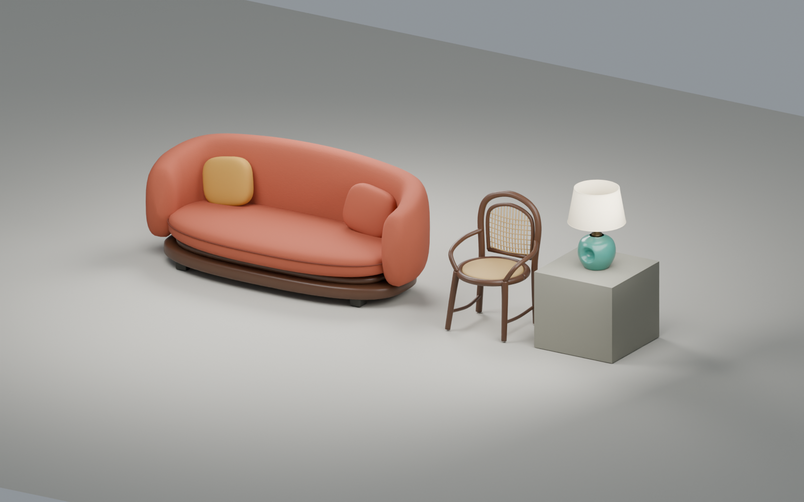

# Three-piece mesh study

Built September 7, 2026 after the first procedural catalog was rejected for similar silhouettes, small scale and block construction. These are visual candidates, not released catalog items.

## Result

| Candidate | Construction | Size in studs, width × height × depth | Review triangles |
|---|---|---|---:|
| Crescent sofa | Blender curved upholstered shell, deep bench cushion, welt, loose pillows, recessed walnut base with four attached rectangular supports | 11.561 × 4.550 × 5.143 | 21,273 |
| Loop bentwood chair | Blender continuous back hoop, curved arms, splayed legs and woven back | 3.261 × 4.964 × 2.820 | 13,168 |
| Tide lamp | Prop Forge ceramic base, Blender replacement shade and neck | 2.198 × 3.140 × 2.198 | 5,643 |

The review avatar is the user's avatar at its measured 5.739976-stud height. Sofa and chair bounds begin at floor height zero. The lamp begins at the three-stud plinth top. Current geometry verification is in `verification.json`; `studio-verification.json` records the earlier geometry pass. The new foot attachment check is in `support-verification.json`. Follow [the construction and scale standard](physical-scale-standard.md) for future pieces.

Blender is the preferred main furniture authoring route from this test. It gives deliberate silhouettes, continuous curves and controllable construction. Prop Forge is useful for a distinctive starting form, but this lamp required repair before it belonged beside the other pieces. Do not count recolors as new furniture designs or expand this study into another large preset catalog before the visual direction is accepted.

## What is installed

In **Room Royale - Test**, place 86511797738570:

- `Workspace.RoomRoyaleMeshStudy`: the three mesh candidates, neutral review floor and wall, lamp plinth, two low-intensity local fill lights and avatar scale reference. Final camera looks toward `(820, 2.8, 420)` from `(830, 7.7, 440)`.
- `ServerStorage.RoomRoyaleMeshStudySource`: current importer plus ten mesh-data modules. Large JSON records are split into StringValues to stay below Studio's 200,000-character Source limit.
- `ServerStorage.RoomRoyaleFurnitureReferences.RoomRoyaleMeshImporter_Pass01`: retained first importer, marked deprecated. Its original centering mistake was corrected on the live mesh contents and bounds were refreshed with ApplyMesh.

Global Lighting was retained: ClockTime 14.5, Brightness 1.5, Ambient and OutdoorAmbient 70/255, ExposureCompensation 0. The review adds local fill lights at brightness 0.30 and 0.22. The screenshot above is the persistent asset version in **Play**. The old `assets/roblox-review.jpg` is retained as the pre-support-fix Edit preview.

The prior procedural galleries and existing ItemAssets remain in place. Catalog IDs, prices and shop bindings were not changed. The accompanying neighborhood work changes game source; see [the build record](../../docs/neighborhood-build-2026-09-07.md). No place save or publish was performed.

## Runtime and upload boundary

The locally created EditableMesh and EditableImage object content did not survive the Edit-to-Play copy. A Studio-only client reconstruction was tested and failed with `EditableMesh is not accessible. Go to the Security Tab in Experience Settings to enable this API.` The temporary LocalScript was removed, and authoring source was moved to ServerStorage. No runtime mesh-API setting was changed.

The earlier automatic approval review rejected uploads pending explicit authorization. The user then approved the three candidates and their materials. Ten mesh assets and 27 image assets were uploaded for private Test-place use; `private-assets.json` records every ID, original material, center and size. No place publication was required.

All ten MeshParts and their 30 material-map references reached the Play client as URI content, and ContentProvider preload reported no failures. The updated sofa supports are present in that capture. `UploadReview.lua` records successful uploads in a Studio ledger before continuing, so retries reuse existing IDs. Roblox rejected an overlong asset name; names are now capped at 50 characters. Persistent image references use SurfaceAppearance's map properties because CreateSurfaceAppearanceAsync accepts EditableImage content. The current import is independent of runtime EditableMesh settings.

Current previews use smooth normals and flat PBR color/roughness/metalness maps. Blender's fine procedural fabric bump and ceramic coat are not present in the Roblox preview. Production preparation still needs texture baking or an equivalent supported material pass, collision proxies, LOD/performance review, tint regions, thumbnails and catalog integration. These are not production-ready simply because the geometry imports.

## Backups and reconstruction

Durable files are committed here: `assets/furniture-study.blend`, three `rr_*.glb` interchange models, ten `.mesh.json` records, source scripts, native review images, original generated lamp evidence and `assets/RoomRoyaleMeshStudySource.rbxmx`. The original Blender scenes were retained; the first study pass is also backed up locally at `build/art-study/furniture-pass01.blend`.

To restore the authoring source, insert `RoomRoyaleMeshStudySource.rbxmx` into Studio and put its folder under ServerStorage. Through the authoring plugin in **Edit** mode, run `require(game.ServerStorage.RoomRoyaleMeshStudySource.PersistentReview).Build()`, then `require(game.ServerStorage.RoomRoyaleMeshStudySource.BuildGallery)`. The persistent builder constructs all three candidates before replacing the review models and moves the prior models into ServerStorage.RoomRoyaleFurnitureReferences. It uses the recorded asset IDs and performs no uploads. It was executed successfully in the Test place after the Play verification; dimensions match the source exports. The XML was parsed and checked locally; a fresh Studio XML import itself has not been tested.

`RebuildReview.lua` and ImportReview retain the earlier EditableMesh route for geometry development. The avatar is an optional live reference and is not embedded in the source package. Neither restoration path changes the runtime mesh API setting.

To regenerate Blender furniture, run `build_furniture.py` in a fresh Blender process or rename the existing study scene first. Run `refine_lamp.py` after the furniture script; its saved conformed Forge mesh supplies the generated base. Then run `export_meshes.py`. Coordinates are studs with Blender unit scale 0.28 meters. Each export includes its own material-group geometry.

Run `verify_assets.py` with Python 3 to check finite vertices/normals/UVs, valid triangle indices, part triangle ceilings, grounded bounds and GLB container integrity. Run `package_source.py` to regenerate the source XML.

## Prop Forge evidence

Used the installed local pipeline at `D:/code/lookshelf--forge/Tools/prop-forge`. Job `20260907084454-yu1i` used Hunyuan, reference seed 170907, rotation seed 42, mesh seed 101, fast quality and requested height 0.88 meters. `lamp-request.json` preserves the request. Original reference is `assets/lamp-forge-reference.png`.

The generated raw mesh had 518,512 triangles and 67,876 non-manifold edges. Forge conform remeshed and reduced it to 5,510 triangles. The installed Blender export options contained `export_colors`, removed by Blender 5.2. Blender returned exit code zero despite the Python exception, so Forge incorrectly marked conform complete and deleted its intermediate raw file. The original raw output remained in ComfyUI's output cache and was recovered from there.

`forge_blender_compat.py` filters unsupported exporter options without modifying the installed Forge source. Manual conform and texture invocations use `--python-exit-code 1` so Python failures cannot report success. MV-Adapter repaint did not complete; the fallback texture was baked from five matted generated views using Forge's existing texture stage. The resulting GLB and four-angle render are retained as `lamp-forge-raw-textured.glb` and `lamp-review.png`. That result has obvious texture seams and a ragged shade. It was not accepted as the finished candidate.

The refined candidate retains Forge's ceramic base and thumb hollow. Blender replaces the neck and shade and assigns clean ceramic, bronze and linen materials. It intentionally does not use the rejected generated texture atlas. `lamp-forge-conformed.glb` is retained so the cleanup is reproducible without rerunning AI generation.

Roblox API behavior references: [AssetService](https://create.roblox.com/docs/reference/engine/classes/AssetService), [EditableMesh](https://create.roblox.com/docs/reference/engine/classes/EditableMesh). Runtime restrictions above were also checked directly in the Test place.
