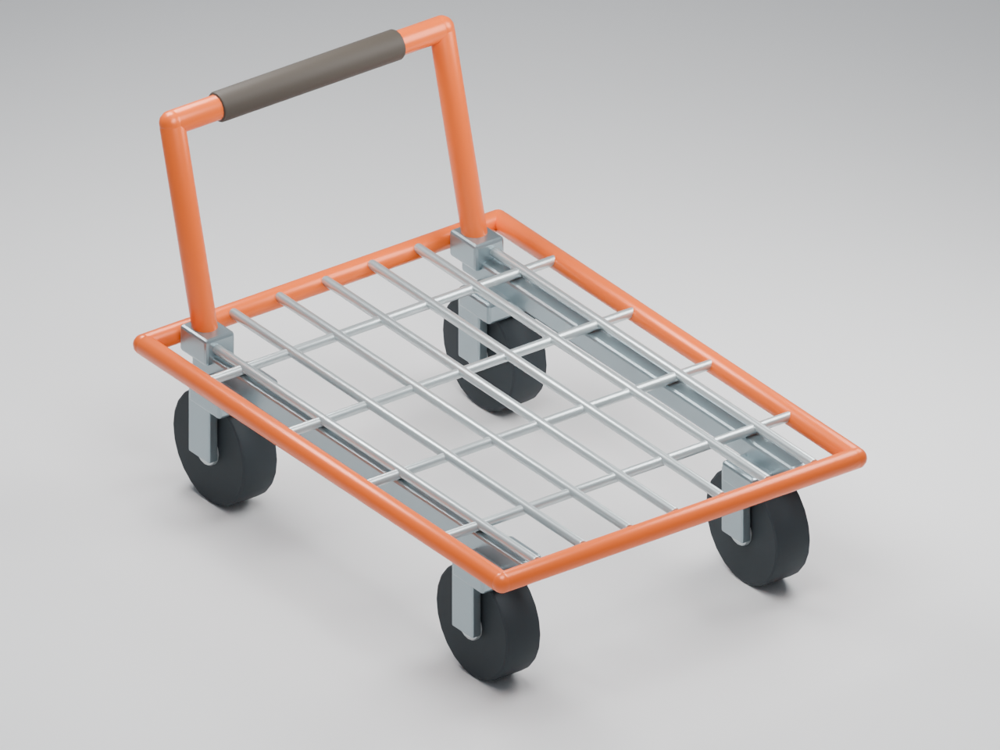

# Warehouse flatbed

An orange tubular push cart with an open galvanized wire deck, visible chassis rails, four caster forks, rubber wheels, and a dark hand grip. The specification generates both the editable Blender asset and the ordinary Roblox parts used by the cart lab.



The preview is a Blender render. The runtime rendition uses the same component dimensions, positions, and colors; Blender adds small manufactured edge bevels. The root task handles inspection in Roblox and integration with the running avatar, cargo, and effects.

| Property | Value |
|---|---:|
| Visible components | 49 |
| Runtime BaseParts including invisible VisualRoot | 50 |
| Evaluated Blender triangles | 8,532 |
| Width × height × length | 4.83 × 4.222 × 6.937 studs |
| Deck top, relative to Body | -0.7 |
| Wheel ground line, relative to Body | -2.5 |
| Pushbar center, relative to Body | Y 1.55, Z 3.45 |

The model faces -Z. `Body` remains the invisible 5 × 1 × 7 physics hull. No cosmetic part collides, touches, queries, or contributes assembly mass. The source changes only Body's transparency.

`Flatbed.build(cart, body)` returns `VisualRoot`. Its `VisualMount` Motor6D starts with identity C0/C1, allowing the client to compress or lean the entire visual cart without moving the collider. Cargo should use `VisualRoot.CFrame` and the cart's `CargoDeckY` attribute.

Each `CasterMount_FL/FR/RL/RR` has a translation-only rest C0. Apply caster yaw as `restC0 * CFrame.Angles(0, yaw, 0)`. Each `WheelMount_FL/FR/RL/RR` spins about its local X axle, using `restC0 * CFrame.Angles(spin, 0, 0)`. Every motor stores its initial C0 in `RestC0`. Tires are named `Wheel_FL/FR/RL/RR`; each metal hub follows its tire. `HandleLeft` and `HandleRight` are attachments on VisualRoot at X ±0.95, Y 1.55, Z 3.45. Wheel radius is 0.65 studs.

Edit `flatbed_spec.py`, then rebuild in a fresh process:

```powershell
& 'D:\Blender\blender.exe' --background --factory-startup --python-exit-code 1 --python 'D:\code\RoomRoyale\authoring\cart-flatbed\build_flatbed.py'
```

This writes `assets/warehouse-flatbed.blend`, `assets/rr_warehouse_flatbed.glb`, two PNG previews, five `.mesh.json` material groups, their manifest and bounds verification, and `prototype/cart-lab/Flatbed.lua`. Blender coordinates use 0.28 meters per stud. The JSON bridge records use Body-local Roblox coordinates without recentering the cart onto the floor.

The GLB keeps named component objects and Roblox parent/motor information in custom properties. The five material-group JSON files match the existing `authoring/art-study` geometry format for a static Studio mesh review. They merge moving components by material, so use the component GLB/specification when building an animated mesh version. The native runtime requires neither uploaded asset IDs nor EditableMesh permissions. No assets were uploaded and no Studio instance was modified by this authoring work.

The proportion and construction references were the [Costco wire-deck auction listing](https://www.grafeauction.com/event/costco-san-antonio-flat-bed-carts-store-689-1/lot/1) and the existing project scale guide in `authoring/art-study/physical-scale-standard.md`. This is a stylized original cart without branding.
