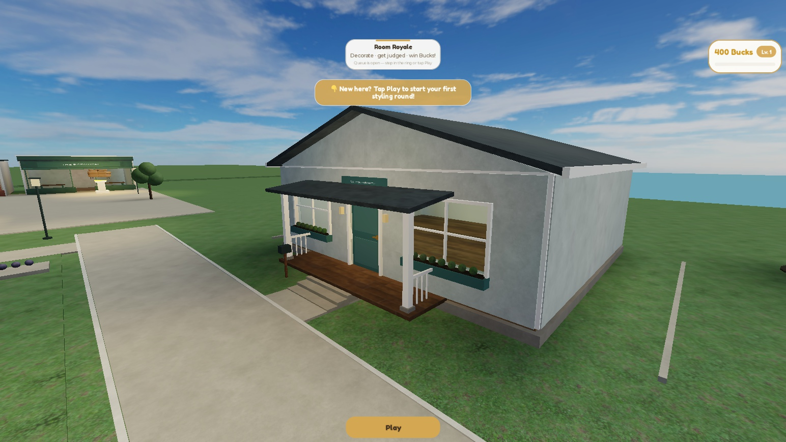
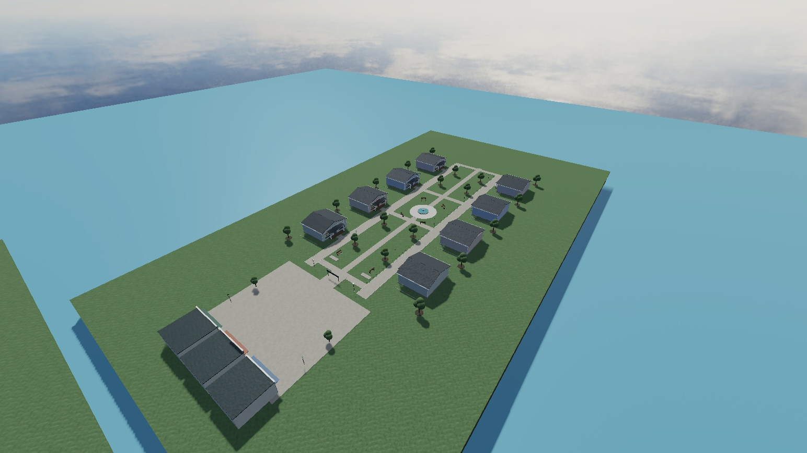

# Neighborhood build

## Work sequence

- [x] Read the workflow principles and inspect current source and Test-place identity.
- [x] Capture source and scene backups before modifying Studio.
- [x] Build one enclosed, avatar-scaled house with a hinged, prompted front door.
- [x] Build the central green, connected walks and three shop buildings at the existing shop end.
- [x] Keep eight vacant homes visible; replace a vacancy after a player's profile and home are ready, and restore it on leave.
- [x] Make saved furniture travel with the house rather than stay at an old world position.
- [x] Correct the sofa supports, document physically plausible dimensions, and upload the approved furniture assets.
- [x] Verify geometry, door opening/closing, lot lifecycle, saved-placement transforms and the visible result in Test.
- [x] Compare all twelve changed/new runtime source files with Studio; every comparison matches.
- [x] Commit source, evidence and the decision trail; leave the Test place ready to inspect.

## Acceptance

Eight lots have exactly one visible home after each completed join/leave transition. No slot is assigned twice, loading players do not erase vacancies, and a cancellation token prevents a departed player's delayed load from occupying a lot. A player home uses the new enclosed template and restores saved items in house-local space. Unplaceable legacy items remain owned and their saved records are retained until the player chooses a valid replacement position. Doors open from either side, expose an avatar-sized passage and close again. Spawn and queue stay connected to shops and the park.

The Studio baseline is place 86511797738570, universe 10764620924, Edit mode, Neighborhood version 4 and no instantiated HousingDistrict. The repository baseline is caa928a. Existing source generates Neighborhood version 7 and strips competition-room geometry to create houses. The new architecture uses an explicit layout, a complete house template and a lot lifecycle, keeping the existing public spawn/queue anchors.

The work uses reversible Test-place changes, source/scene backups and runtime acceptance checks. The existing neighborhood brief settles the layout direction; a new architecture design contest is unnecessary.

## Built result

Eight cottages face a central green with a fountain court, benches, trees, lamps, mailboxes and connected walks. Four exterior palettes distinguish the addresses. A plaza at the spawn end leads to three walk-in shop buildings: The Botanical, Royale Home and The Textile Room. Existing queue and rotating purchase pedestals remain at that end.

The house has a 36 × 32-stud floor, 10.8-stud walls, a ceiling and gabled roof, glazed windows, supported porch and steps. Its 4.8 × 8-stud door opening was tested with the user's 5.74-stud avatar. E opens or closes the hinged door. The door refuses to close through a character. Interior wall liners and floor retain painting, and the house keeps its own placed-item folder.

`HouseLotService` keeps vacancies visible while profiles load. Once an owner's house is built and furnished, it replaces the vacancy without yielding between the swap steps. Leaving rebuilds the vacant home. New placement records carry `house-local-v2`; moving to a lot on the opposite side of the park preserves their relation to the home. Legacy records infer their old lot, account for the new floor height and remain stored if they do not fit.

## Verification and limits

`tools/NeighborhoodAcceptance.server.lua` and its client companion exercised the actual game module state and HousePlaceSave remote. The final evidence contains 36 automated acceptance checks plus three follow-up checks: actual inside-door prompt input, PlayerRemoving restoring eight vacant homes, and persistent furniture content loading. See [final results](evidence/neighborhood-acceptance-final.json).

The checks cover unique reservations for all eight slots, rejection of a ninth, replacement/restoration, actual avatar passage, collision blocking, floor/wall/ceiling support, unsupported placement rejection, support while loading an unparented house, legacy floor-height conversion, opposite-lot transforms and reuse of a retained placement record. One real player was connected. Eight simultaneous networked clients and a live delayed-profile disconnect were not exercised; those paths received static review and slot lifecycle tests.

Fixture mutations used confirmed ProfileService mock profiles. An earlier exploratory Play session loaded the existing Test profile because a DataModel attribute did not copy into Play; no fixture mutation was made in that session. Moving the opt-in flag to ServerStorage fixed the test setup. The final Edit place has `ServerStorage.NeighborhoodPreviewProfiles = false`, so ordinary Test Play uses its normal saved profiles. Temporary test scripts were removed. To rerun acceptance, set that attribute true **before** Play, install both test drivers in their corresponding server/client script containers, and remove them afterward.

Support validation uses oriented part bounds, including bounds of placed furniture for tabletop decor. It does not prove contact with every concave triangle in a complex mesh. Unsupported or out-of-room legacy records can require manual repositioning. The first neighborhood uses a shared cottage shell; customized player furniture and paint load into that shell. Distinct player-selected house architectures are a later feature.

The shops are usable buildings with display tables; category-specific shop stock and interactions have not been added. Existing purchase pedestals still provide the current shop behavior. Landscaping and shop interiors are a first architectural pass. The three imported furniture candidates remain in the authoring gallery, separate from the current 96 ItemAssets. They still need production collision, material and catalog work.

## Backups and recovery

- Original build baseline: `caa928a`. Current source and complete scene snapshots are synchronized on the repository default branch.
- Studio: `ServerStorage.NeighborhoodBefore_20260907` retains the former neighborhood, spawn, changed source and original sofa feet. Its `SourceBefore` scripts are disabled.
- Local live-source copies: `build/neighborhood-2026-09-07`. The original Blender study is `furniture-before-support-fix.blend` in that directory.
- Updated Blender, GLB, mesh JSON and importable source XML are in `authoring/art-study/assets`. The XML includes private asset IDs and a persistent gallery rebuild module; see its README.
- The new neighborhood is reproducible from the committed layout and builders on server startup. The separate furniture gallery is reconstructed through `PersistentReview.Build()`.

This build did not publish Live. The subsequent repository sync saved the Test place to Roblox and exported the complete [Test scene](../places/RoomRoyale-Test.rbxlx). [Current snapshot verification](evidence/studio-repo-sync.json) compares all managed scripts to a fresh source build. The approval reviewer initially rejected a broad ProgressionService replacement; accepted narrow edits are limited to the house coordinate-space field and the opt-in Studio mock selector.

## Review

GPT-5.6 Sol independently reviewed source and the decision trail. Its retained-record, missing-asset and support-validation findings were addressed and covered by the final runtime checks. The audit timestamp correction is recorded as a new row rather than silently rewriting history. All available review models were from the GPT family, so this is a separate-model review rather than a different-family review.

The follow-up review found no remaining definite defect in these fixes. Remaining usability/evidence limits: clicking an owned item whose source asset is missing currently reports only a developer-console warning; actual remote placement used a Floor catalog item, while Wall and Ceiling contact tests used a synthetic prop. The checks establish the support behavior, not every catalog item's pivot convention. Full eight-player network testing remains open.

Repository validation and Rojo build passed. [Source comparison](evidence/neighborhood-source-sync.json) confirms all twelve changed/new runtime files match the installed Studio sources after newline normalization. No temporary acceptance driver remains in the final Edit place.
