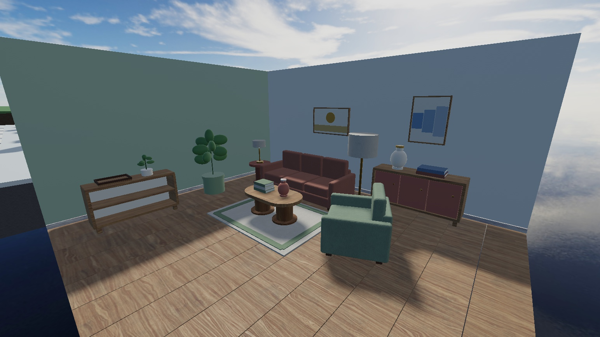
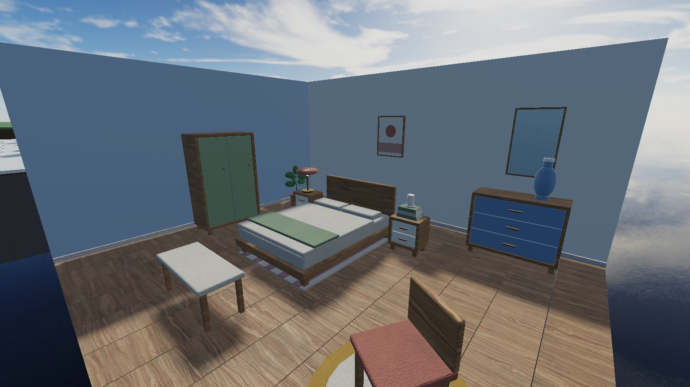

# Procedural furniture catalog

Use native ProceduralModels as the authoring system for the new Room Royale collection. Build a small number of furniture-family generators with constrained, named recipes, shared finish definitions and a visual approval gallery. All existing ItemAssets remain placeholders. This changes the production method proposed in the [House redesign brief](neighborhood-house-redesign-2026-09-06.md), while preserving its scale and gameplay requirements.

## What is confirmed

Roblox announced full release on May 18, 2026, including support in Team Create and live games. The connected Studio MCP exposes `generate_procedural_model`, which inserts a parameterized model from a prompt. I can drive it, inspect the generated source and refine it. The exposed generation tool describes its initial output as built from Roblox primitive parts, so its output needs visual review before becoming production art. [Release announcement](https://devforum.roblox.com/t/full-release-procedural-models-build-parametrized-3d-models-with-code-or-ai/4642542)

A ProceduralModel points to a Luau generator with an `Attributes` table and `OnGenerate` function. Changing parameters or Size regenerates its output. The generator writes into a supplied container; it must not modify unrelated game objects. Source belongs in the repository, and generated children are disposable. Hand edits inside Generated will not survive regeneration. [Procedural model guide](https://create.roblox.com/docs/parts/procedural-models)

The user's `Chair.Width = 1.4` example expresses the right idea. For custom parameters, the actual authoring call is an attribute change such as `chair:SetAttribute("BackHeight", 2.7)`. Overall dimensions can use the native Size property. Parameter names only have meaning if our generator implements them. A `Style = "Chunky"` switch needs actual shape rules or components; the class itself supplies no design intelligence.

## What this changes for the collection

| Family | Procedural work | Authored detail still worth making |
| --- | --- | --- |
| Tables, desks, shelves, cabinets | Proportions, leg/base options, shelf/drawer counts, thicknesses, material channels | Beveled edge profiles, special handles and distinctive joinery |
| Sofas, chairs, beds | Seat count, chaise side, frame length, cushion arrangement, leg families | Good cushion shapes, rounded arms, piping, fabric response and draped throws |
| Rugs and wall art | Size, borders, repeat scale, frame dimensions, palette variants | Original patterns and artwork; procedural resizing cannot invent an appealing pattern |
| Lamps, vases, planters | Repeated/profiled forms, stem/shade dimensions, palette and arrangements | Organic/asymmetric silhouettes, ceramic detail, foliage and curated lighting |
| Small objects and grouped decor | Book stacks, tray arrangements, repeated forms and controlled variation | Recognizable objects and deliberate compositions rather than random clutter |

ProceduralModel is not limited to cubes as an architectural concept. A generator can assemble a designed kit of mesh components as well as create simpler geometry. Verify mesh-content access and generation cost in a dedicated proof before promising arbitrary runtime mesh generation. Do not stretch a single sofa mesh to every width; retain cushion proportions and seams by rebuilding from appropriate components.

One good sofa family can yield an armchair, loveseat, three-seat sofa and left/right chaise configurations with coherent finishes. That is valuable reuse. Hundreds of numeric combinations are not automatically hundreds of desirable store items. Ship named presets with distinct silhouettes and let finish variants share geometry where possible.

## Authoring and release workflow

1. Define one family's dimensions, useful options and valid combinations in repository Luau. Keep visual rules within that family instead of building one enormous universal furniture generator.
2. Produce a small gallery of contrasting recipes and inspect them at avatar scale, in the starter House and beside related pieces. AI generation can draft the family; reviewed source owns its subsequent behavior.
3. Inspect regeneration, generator errors, bounds, floor contact, collision, support planes, appearance channels and part/mesh counts. Check extreme supported parameters and deterministic regeneration.
4. Curate catalog items from approved recipes. Record ItemId, generator version, recipe version, parameters, finish references, placement layer, support metadata, category and theme tags. Freeze these identities before assigning purchases or rewards.
5. Materialize the approved recipe into a normal placement model for the first shipping integration. Preserve its recipe as source metadata. Add the bottom contact pivot, explicit collision proxies and support data in that export step. Do not ship authoring helper instances or generator scripts embedded in every item.
6. Test generating on demand only where it offers a measured benefit. A thousand generated Parts still cost a thousand Parts, and regeneration still does work. Avoid regenerating a player's furniture while dragging its placement ghost or recoloring a supported appearance channel.

The engine exposes `GenerationError` and `WaitForGenerationAsync` for checking generation. Wait for completion before inspecting output or exporting an item, and fail the export if generation failed. [ProceduralModel API](https://create.roblox.com/docs/reference/engine/classes/ProceduralModel)

The shipping record should point to a pinned recipe version. Changing a generator must not silently reshape previously purchased furniture. A new version needs regeneration checks, placement-footprint validation and an explicit migration decision. The existing catalog's owned-copy, support-surface, rug-layering and House-local persistence work remains necessary.

The guide currently lists package conversion as unsupported. Keep generator modules, recipes and model assembly in Rojo rather than relying on Creator Store packages for version ownership. Prove any new native class/property round trip with the installed Rojo version. [Current limitations](https://create.roblox.com/docs/parts/procedural-models)

## First collection built in Test

The first collection contains **47 candidates across ten generator families**, plus 12 native material/color samples and two furnished room samples. These are original recipes, not replacements copied from the existing ItemAssets. The full item list, sizes and parameter values are recorded in the [recipe snapshot](evidence/furniture-recipes-2026-09-07.json).

| Generator family | Items | Included designs |
| --- | ---: | --- |
| Table | 6 | Coffee, side, dining, console and desk |
| Sofa | 4 | Armchair, loveseat, three-seat track and rolled-arm sofas |
| Storage | 6 | Low shelf, bookcase, sideboard, nightstand, dresser and wardrobe |
| Rug | 6 | Border, stripe, checker and round designs, including a runner and mat |
| Lamp | 4 | Drum and mushroom shapes at table and floor heights |
| Decor | 8 | Three vases, two book stacks, tray and two candles |
| Plant | 3 | Desk, medium and tall planters |
| Wall | 4 | Three geometric prints and a mirror |
| Chair | 4 | Slat chair, panel chair, padded stool and bench |
| Bed | 2 | Double and single frames with pillows, duvet and folded throw |

The palette uses oak, walnut, cream, sage, clay, lake blue, ochre, rose, charcoal, brass, stone and leaf green. Finishes currently use Roblox's built-in materials. The rug patterns and wall compositions are generated geometry. This pass does **not** include an uploaded custom PBR texture library. Stone is a review swatch, not yet a furniture finish option.





The room samples are 24 by 20 stud cutaways with 11.5 stud walls. They test the collection together at the proposed smaller House scale. They do not replace the starter House. [Full gallery image](evidence/furniture-gallery-2026-09-07.jpg)

### Source and repeatable installation

The source lives in [authoring/furniture](../authoring/furniture), outside the game's default Rojo mapping. [CatalogRecipes.lua](../authoring/furniture/CatalogRecipes.lua) owns names, IDs, dimensions, categories, placement surfaces and parameters. Each family has a separate generator. [RoundedBox.lua](../authoring/furniture/RoundedBox.lua) creates beveled CSG solids for cushions and selected edges. [BuildParts.lua](../authoring/furniture/BuildParts.lua) supplies the small shared geometry and attachment helpers.

The native prompt-generated sofa was useful as a draft. It exposed only basic color/material controls, retained an oversized model box, and included much more helper code than this collection needs. Its source and dependencies are retained in the [reference archive](../authoring/reference/sofa-ai-draft/README.md). The collection uses the repository's own sofa generator.

```powershell
pwsh -NoProfile -File tools/Build-FurnitureInstaller.ps1
rojo build furniture-authoring.project.json --output build/FurnitureAuthoring.rbxmx
```

The first command writes `build/InstallFurniture.luau`. Execute that file's text through Studio MCP in Edit mode. It checks the exact Test place ID, installs source into a temporary authoring folder, generates and verifies all recipes, bakes normal Models, and builds the room samples before moving the previous collection into a checkpoint. A failed preflight leaves the current collection in place and retains the pending build for inspection. Running the same successful source revision again verifies and reuses it.

The second command builds a standalone toolkit for manual import. It contains ModuleScripts, not an autorunning Script. Importing it does not build or replace a scene.

Current Studio locations:

- `Workspace.RoomRoyaleFurniturePilot`, gallery origin `600, 0, 400`.
- `Workspace.RoomRoyaleFurnitureShowcase`, room origin `720, 0, 420`.
- `ServerStorage.RoomRoyaleFurnitureAuthoring`, generator and recipe modules.
- `ServerStorage.RoomRoyaleFurnitureCandidates`, 47 baked Models with floor-contact pivots.
- `ServerStorage.RoomRoyaleFurnitureReferences`, original AI draft and earlier authoring checkpoints.

### Verification and recovery

The [recorded Studio verification](evidence/furniture-verification-2026-09-07.json) confirms all 47 candidates generated and baked. The collection contains 383 visible BaseParts, with 2 to 19 per item, plus one invisible placement anchor per item. This is a part count, not a triangle count or device performance claim. CSG geometry costs still need profiling.

Checks exercised recipe identity and parameters, generation completion, bounding dimensions, floor contact, appearance channels, authoring collision settings, table color/width changes, sofa seat-count/arm changes, and restoration of the original geometry. Export checks confirmed normal Models with bottom pivots at the origin and no embedded scripts or ProceduralModels. A second installer run reused the same revision without another checkpoint.

On September 7, the user explicitly authorized creative edits in the Test instance with documentation and backups. The initial six-table pilot and the first full collection pass are retained in ServerStorage. Later installer runs preserve the previous four authoring folders together. To restore an older checkpoint, retain the current four folders, then return that checkpoint's toolkit/candidates to ServerStorage and its gallery/rooms to Workspace. Their object references remain linked.

Git is the durable backup of recipes, generator source, installer, verification and screenshots. Rebuild from that revision if Studio closes without saving. The generated CSG instances are reproducible from source; this is not a full `.rbxl` backup. The existing 96 ItemAssets and game source were not replaced, and the place was not saved or published by this work. No Play session or profile write was performed.

### Remaining work before replacing the game catalog

This collection establishes a working authoring and review path. Production approval remains open. The next pass should refine the most prominent silhouettes and material response in a real House with avatars, then add missing families such as sectionals, curtains, kitchen/bath pieces and more distinctive sculptural objects.

Custom fabric/wood/ceramic maps, draped cloth, richer original artwork and organic foliage remain art work. The mirror is a glass/reflectance approximation; it does not render a live reflection of the room. Pill table tops still use overlapping components whose grain continuity deserves review.

The bake currently makes floor furniture's visible parts collidable and leaves rugs, tabletop objects and wall pieces non-colliding. Release needs deliberate collision proxies, shelf/table support regions, wall attachment handling, rug layering, catalog thumbnails and the existing placement/persistence integration. The samples place small objects directly at measured support heights; they do not prove the game's support-placement logic. Purchases, rewards and saved ownership should only reference approved, versioned recipes after those checks.
